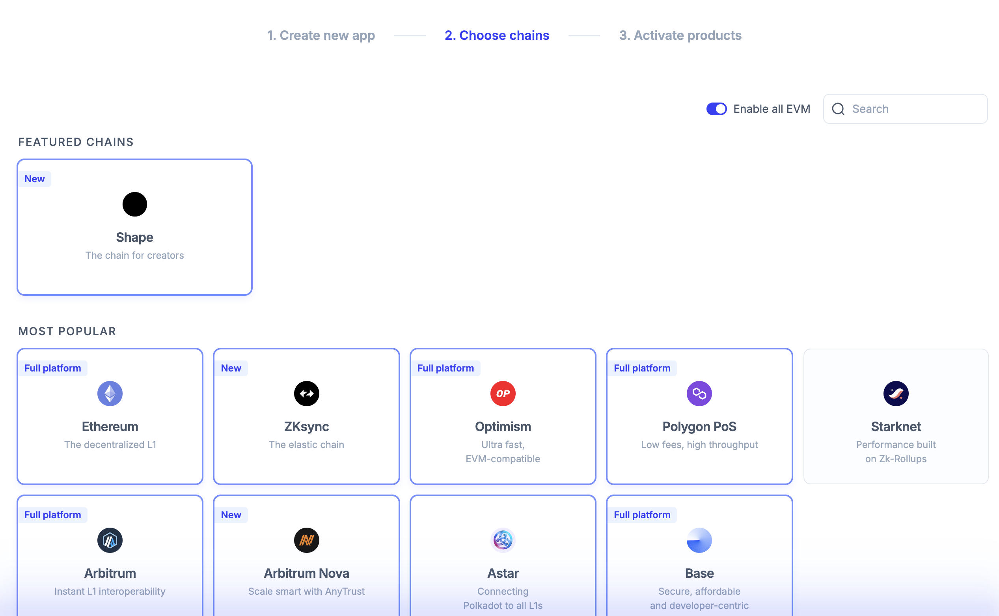
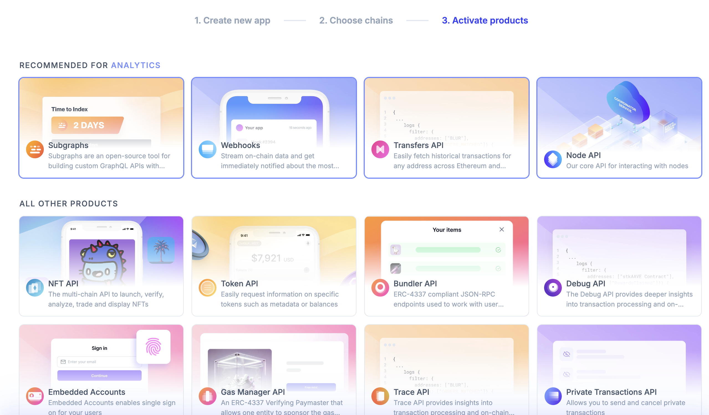

# Guide for Validators

1. Obtain API key(s) from Alchemy:

### Step 1: Select Use Case - Analytics

When creating a new Alchemy API key, select **Analytics** as the use case.


---

### Step 2: Enable All EVM Chains

In the next step, ensure that **All EVM chains** is selected at the top. This will enable compatibility across all supported Ethereum-based chains.



---

### Step 3: Enable Transfers API

Finally, make sure to select **Transfers API**. This will allow the miner to track token transfers across multiple networks.



---

2. Obtain you PayPangea API key:

Paypangea is a free decentralised wallet that we use for web3 authentication. You will find your API key under Profile settings on the top right corner.

3. Run `source ./scripts/start_validator.sh` and follow prompts. 

4. Check if .env file was created in your root directory with the following:

```bash
ALCHEMY_API_KEY=<YOUR_API_KEY>
PAYPANGEA_API_KEY=<YOUR_API_KEY>
```

>[!NOTE]
> We recommend running with --logging.trace while we are in Beta. This is much more verbose, but it will help us to debug if you run into issues.